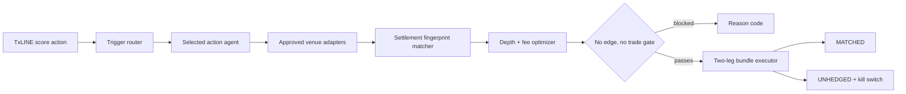

# txBet


**The match event wakes the agent. Settlement math decides.**

txBet is a TxLINE-powered cross-venue arbitrage orchestrator for prediction markets. A confirmed live action—such as a red card, goal, injury, penalty, or pressure window—wakes a selected agent. txBet then compares exact binary complements across approved venues and proceeds only when equal executable depth remains profitable after fees and a safety buffer.

> **No edge, no trade.** The bundled app uses synthetic TxLINE-format replay data, simulated venue books, and simulated IOC fills. A return becomes locked only after both complementary legs fill equally and the contracts settle under compatible rules.

## Is this arbitrage?

The event itself is not the arbitrage. Buying one side as soon as a red card or goal occurs is **event-driven latency trading**: it still depends on the prediction being right or on exiting later at a better price.

txBet uses the event only as the wake-up signal. It calls a position **arbitrage** only when it can buy exact complementary outcomes on different venues, both contracts resolve under the same rules, and the complete after-cost position is below the fixed settlement payout. Until both legs fill equally, the opportunity is only a candidate and any unequal fill is explicitly `UNHEDGED`.

## What is working

- Six selectable live-action trigger agents over one shared matcher and optimizer.
- Exact settlement fingerprints; no fuzzy market-title matching.
- Cross-venue YES/NO complement checks for fixed-$1 binary contracts.
- Depth-weighted sizing bounded by capital, exposure, freshness, liquidity, and minimum return.
- Adapter-specific fee models plus a configurable safety/slippage buffer.
- Explicit `MATCHED`, `UNHEDGED`, `UNFILLED`, and fail-closed `INVALID` execution states.
- A deterministic browser replay with profitable, no-trade, and partial-fill scenarios.
- Clickable referee-style agent profiles with trigger rules and supported market families.
- A synthetic backtest and latency lab that separates locked replay P&L from unhedged exposure.
- A terminal replay command using the same strategy core.
- A server-side TxLINE client for guest auth, score snapshots, and authenticated score SSE.
- Unit coverage for settlement mismatches, math, trigger routing, freshness, depth, and leg risk.

Live venue order placement is intentionally **not** included. [`VenueAdapter`](src/adapters/venue.ts) defines the required `discover → quote → preflight → IOC → reconcile` contract without pretending separate platforms offer atomic execution.

## Run it

Requirements: Node.js 20.9+ and pnpm 10.

```bash
pnpm install
pnpm dev
```

Open [http://localhost:3000](http://localhost:3000).

Run the deterministic terminal demo:

```bash
pnpm agent:demo
```

Verify a clean clone:

```bash
pnpm verify
```

## Demo tapes

1. **Red card / matched bundle** — YES at `$0.54` and NO at `$0.40`; the edge survives fees and the safety buffer, then both simulated legs fill.
2. **Corner pressure / no trade** — `$0.72 + $0.34 = $1.06`; txBet scans and refuses to trade.
3. **Penalty / partial-fill risk** — one leg fills 100 shares and the other fills 70; txBet marks 30 YES shares unhedged and trips the kill switch.
4. **Latency recheck** — the same synthetic red-card opportunity is compared at 800 ms and 3,000 ms; the fast route finds a candidate while the delayed books have already closed the gap.

The successful 100-share tape models:

```text
Raw complementary cost   $94.00
Venue fees                $0.80
Safety buffer             $0.40
All-in cost              $95.20
Settlement payout       $100.00
Modeled net profit         $4.80
Modeled net return          5.03%
```

Values are calculated in integer microdollars. Displayed totals are rounded to cents.

The bundled backtest contains four deliberately small synthetic windows. Its P&L is useful for demonstrating accounting, safety states, and latency sensitivity; it is not historical evidence and does not predict future returns. A credible production study would require timestamped TxLINE events, timestamped executable venue order books, venue-specific fees, real latency measurements, and fill/rejection records.

## TxLINE live-input boundary

The hackathon track requires TxLINE as a live input. txBet includes the live score boundary separately from the pitch-safe replay so judges can test both without connecting a prediction venue.

Copy the environment template:

```bash
cp .env.example .env
```

Provide an activated token and fixture ID, then run:

```bash
pnpm txline:smoke -- --fixture YOUR_FIXTURE_ID --seconds 15
```

The smoke command uses:

| Purpose | TxLINE endpoint |
|---|---|
| Guest authentication | `POST /auth/guest/start` |
| Current score bootstrap | `GET /api/scores/snapshot/{fixtureId}` |
| Live score actions | `GET /api/scores/stream?fixtureId=…` |

Requests send `Authorization: Bearer <guest JWT>` and `X-Api-Token: <activated token>`. Follow the official [TxLINE quickstart](https://txline.txodds.com/documentation/quickstart) and [World Cup guide](https://txline.txodds.com/documentation/worldcup) to create access. The token is read only from `.env` and is never printed.

## Architecture



The important modules are:

- [`src/lib/txline`](src/lib/txline) — authenticated TxLINE transport and event normalization.
- [`src/agents`](src/agents) — six trigger configurations over one engine.
- [`src/core/settlement.ts`](src/core/settlement.ts) — exact settlement compatibility.
- [`src/core/optimizer.ts`](src/core/optimizer.ts) — depth, fees, capital, exposure, and return gates.
- [`src/core/executor.ts`](src/core/executor.ts) — deterministic bundle simulation and residual exposure.
- [`src/core/backtest.ts`](src/core/backtest.ts) — synthetic replay accounting that counts only fully matched positions as locked P&L.
- [`src/adapters/venue.ts`](src/adapters/venue.ts) — drop-in contract for future prediction venues.
- [`src/fixtures/demo-tapes.ts`](src/fixtures/demo-tapes.ts) — pitch-safe deterministic scenarios.

See [architecture notes](docs/architecture.md) and the [demo runbook](docs/demo-runbook.md).

## Safety and scope

- v1 supports only exact binary YES/NO complements with the same fixed payout.
- Three-way winner markets, push-capable lines, differing regulation/extra-time scopes, currencies, void rules, or resolution sources fail closed.
- Separate venue orders are not atomic. A partial fill is `UNHEDGED`, never `MATCHED`.
- Malformed or impossible fill quantities are `INVALID`, activate the kill switch, and never contribute to P&L.
- Real platform names/logos are not used in the bundled simulation.
- This repository is software for a hackathon demonstration, not financial or gambling advice.
- Operators are responsible for venue terms and applicable gambling, financial, securities, and consumer-protection laws.

## Hackathon handoff

This repository is private during development, as requested. The track rules require a **public GitHub repository**, deployed access, a demo video, endpoint documentation, and TxLINE feedback before final submission. Change visibility only when the repository has been scrubbed of secrets and you are ready to submit.

## License

[MIT](LICENSE)
