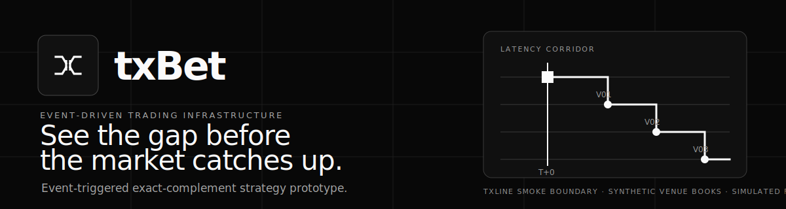
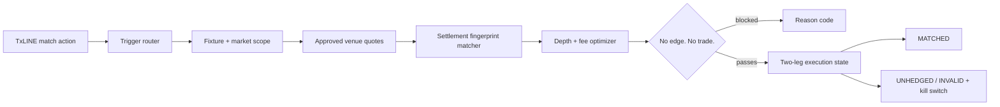

# txBet



> **See the gap before the market catches up.**

txBet is a World Cup hackathon prototype for event-triggered exact-complement strategies. In the bundled synthetic replay, a red card, goal, injury, penalty, or pressure-window event wakes a scan of the same binary market across approved prediction venues.

It proceeds only when it can pair exact opposite outcomes for less than their common settlement payout after executable depth, venue fees, and a safety buffer.

**No edge. No trade.**

> The strategy walkthrough remains a deterministic synthetic replay with simulated books and fills. The console can also show a credential-safe TxLINE REST observation as **live-unverified** and feed one explicitly reviewed Polymarket public book into a **shadow-only** scan. Those read-only panels do not feed the replay strategy or expose an order action. The repository does not place real-money orders.

Detailed delivery status, blockers, and later milestones are tracked in [`currentstate.md`](currentstate.md).

## Why txBet exists

Live match events can reach prediction platforms at different times. One venue may already have repriced after a red card while another still displays an older quote.

That difference is not automatically an arbitrage opportunity. txBet must prove that:

- the two contracts describe the exact same proposition and settlement rules;
- one contract pays on `YES` and the other pays on `NO`;
- both legs have equal executable liquidity;
- the combined price is below the fixed payout;
- the edge remains positive after fees, slippage, and the operator's minimum return.

For example:

```text
Argentina YES on Venue A    $0.54
Argentina NO on Venue B     $0.40
Raw paired cost             $0.94
Settlement payout           $1.00
Gross edge                  $0.06 per pair
```

This is not a directional prediction about Argentina. If both complementary legs fill equally and the settlement rules match, either outcome produces the same payout.

## Target product flow

1. **Listen** — TxLINE supplies supported live match actions.
2. **Wake an agent** — the selected red-card, goal, injury, penalty, or pressure agent decides whether the event qualifies.
3. **Scope the scan** — txBet accepts only quotes for the triggering fixture and the agent's approved market families.
4. **Match contracts** — exact settlement fingerprints replace fuzzy title matching.
5. **Price executable depth** — the optimizer walks both books and includes venue-specific fees and a safety buffer.
6. **Apply risk limits** — capital, exposure, quote freshness, market close time, liquidity, and minimum return must all pass.
7. **Track both legs** — equal fills become `MATCHED`; unequal fills become `UNHEDGED`; malformed fill data becomes `INVALID` and activates the kill switch.

## What is working today

| Area | Current status |
|---|---|
| TxLINE guest auth, score snapshot, and authenticated SSE client | Implemented and credential-safe |
| TxLINE browser status | No-store route; confirmed observations at most 30 seconds old are live-unverified, with bounded upstream reads |
| Live TxLINE events feeding the strategy loop | Deferred to the full World Cup shadow-coverage milestone |
| Google login and embedded wallets | Privy provider creates one EVM and one Solana wallet automatically when a txBet Privy app is configured |
| Six replay-ready trigger configurations | Implemented and tested; live enrichment remains incomplete for injury and corner pressure |
| Exact settlement and complementary-outcome matching | Implemented |
| Depth, fees, capital, exposure, freshness, and return optimizer | Implemented |
| Browser and terminal walkthroughs | Deterministic synthetic replay |
| Synthetic replay report and latency comparison | Synthetic demonstration data |
| Polymarket public World Cup scan | One explicitly reviewed pair at a time; public read and shadow evidence only |
| Replay venue books and order fills | Simulated |
| Live prediction-market order placement | Disabled; no MVP browser or API route can approve, sign, submit, or cancel |

The [`VenueAdapter`](src/adapters/venue.ts) contract defines the future `discover → quote → preflight → IOC → reconcile` integration boundary without pretending separate platforms provide atomic execution.

## Run the demo

Requirements: Node.js 24+ and pnpm 10. The official unified Polymarket SDK
requires Node.js 24, and installs fail closed on older runtimes.

```bash
pnpm install
pnpm dev
```

Open [http://localhost:3000](http://localhost:3000) for the dedicated landing page, then choose **Launch console**. The replay console is also available directly at [http://localhost:3000/console](http://localhost:3000/console).

No credentials are required for the deterministic replay. Without service
configuration, the live-status panel explicitly shows `DETERMINISTIC REPLAY`
and `POLYMARKET REVIEW REQUIRED`.

The landing page uses native smooth anchor scrolling plus GSAP ScrollTrigger as progressive enhancement for the split-window beam, event-to-edge route, quote rails, execution interlock, and telemetry traces. The synthetic event-to-edge, quote-convergence, and four-gate protocol previews loop only while visible, include independent pause/resume controls, and demonstrate pipeline state without implying a live feed or measured venue latency. Reduced-motion preferences keep every asset static and fully visible.

For the clearest first walkthrough:

1. Select **Red card / matched bundle**.
2. Press **Play Tape**.
3. Watch the TxLINE action wake the agent.
4. Inspect the two venue legs and the after-cost calculation.
5. Open **Settlement** to see that either modeled outcome produces the same P&L.
6. Try **Corner pressure / no trade** and **Penalty / partial-fill risk** to see the safety gates.

Run the same strategy core in the terminal:

```bash
pnpm agent:demo
```

Run the complete verification gate:

```bash
pnpm verify
```

## Selectable agents

| Agent | Wakes on | Permitted market families |
|---|---|---|
| Red Card Arbitrage | Confirmed dismissal | Binary winner, qualification, next-goal, and totals markets |
| Injury Arbitrage | High-importance injury or substitution | Binary winner, qualification, and next-goal markets |
| Penalty & VAR Arbitrage | Penalty and VAR transitions | Binary winner, next-goal, and totals markets |
| Goal Reaction Arbitrage | Confirmed goal | Binary winner, qualification, next-goal, and totals markets |
| Corner Pressure | Sustained corners, shots, and possession pressure | Next-goal and totals markets |
| Dangerous Free-Kick | Dangerous-zone free kick | Next-goal and totals markets |

The agents are trigger configurations over one shared matcher, optimizer, and execution-state engine. They are not six unrelated trading systems.

The injury gate expects a player-importance metric, while corner pressure expects derived corner, shot, and possession metrics. Those fields exist in the deterministic replay inputs, but the current live TxLINE normalizer does not derive them automatically.

## Synthetic replay scenarios and modeled P&L

The bundled replay contains four deliberately small synthetic windows:

1. **Red card / matched bundle** — YES at `$0.54` and NO at `$0.40`; the edge survives modeled costs and both simulated legs fill.
2. **Corner pressure / no trade** — `$0.72 + $0.34 = $1.06`; txBet refuses to trade.
3. **Penalty / partial-fill risk** — one leg fills 100 shares and the other fills 70; txBet exposes 30 directional shares and trips the kill switch.
4. **Latency recheck** — the same synthetic red-card opportunity exists at 800 ms but has disappeared by the 3,000 ms recheck.

The successful 100-pair replay models:

```text
Raw complementary cost   $94.00
Venue fees                $0.80
Safety buffer             $0.40
All-in cost              $95.20
Settlement payout       $100.00
Modeled net profit         $4.80
Modeled net return          5.03%
```

Money calculations use integer microdollars. Displayed totals are rounded to cents.

This P&L demonstrates accounting, execution states, and latency sensitivity. It is **not historical performance evidence** and does not predict future returns. Production validation requires timestamped TxLINE events, executable venue books, venue-specific fees, measured routing latency, and actual fill or rejection records.

## Is this really arbitrage?

The event alone is not the arbitrage. Buying one side immediately after a red card or goal is event-driven latency trading because the result still depends on direction or a later exit.

txBet uses the event only as the wake-up signal. A position becomes an arbitrage candidate only when exact `YES` and `NO` complements across different venues cost less than their common payout after modeled costs. In the bundled replay, modeled P&L appears as locked only after both simulated legs fill equally. Real P&L cannot be called locked without reconciled live fills.

## Test the live TxLINE boundary

Copy the environment template:

```bash
cp .env.example .env
```

Add an activated TxLINE token and fixture ID, then run:

```bash
pnpm txline:smoke -- --fixture YOUR_FIXTURE_ID --seconds 15
```

This command authenticates, fetches the score snapshot, listens to the live stream for the requested window, normalizes supported actions, and prints a credential-safe summary. The browser separately reads a bounded score snapshot through `/api/world-cup`; neither path currently sends live events into `runPipeline()`.

The smoke command uses:

| Purpose | TxLINE endpoint |
|---|---|
| Guest authentication | `POST /auth/guest/start` |
| Current score bootstrap | `GET /api/scores/snapshot/{fixtureId}` |
| Live score actions | `GET /api/scores/stream?fixtureId=…` |

Requests send `Authorization: Bearer <guest JWT>` and `X-Api-Token: <activated token>`. Follow the official [TxLINE quickstart](https://txline.txodds.com/documentation/quickstart) and [World Cup guide](https://txline.txodds.com/documentation/worldcup) for access. Credentials are read from `.env` and are never printed.

## Target architecture



Important modules:

- [`src/components/landing`](src/components/landing) — the public product story and console handoff.
- [`src/components/landing/use-landing-motion.ts`](src/components/landing/use-landing-motion.ts) — scoped GSAP ScrollTrigger choreography and reduced-motion handling.
- [`src/app/console`](src/app/console) — the deterministic interactive replay route.
- [`src/lib/txline`](src/lib/txline) — authenticated TxLINE transport and event normalization.
- [`src/server/txline/world-cup-status.ts`](src/server/txline/world-cup-status.ts) — credential-safe browser status boundary.
- [`src/server/polymarket/world-cup-shadow.ts`](src/server/polymarket/world-cup-shadow.ts) — one-pair, reviewed-identity public-book shadow scan.
- [`src/agents`](src/agents) — trigger definitions and routing.
- [`src/core/pipeline.ts`](src/core/pipeline.ts) — event, fixture, and market-family scoping.
- [`src/core/settlement.ts`](src/core/settlement.ts) — exact settlement compatibility.
- [`src/core/optimizer.ts`](src/core/optimizer.ts) — depth, fees, capital, exposure, freshness, and return gates.
- [`src/core/executor.ts`](src/core/executor.ts) — deterministic two-leg execution and residual exposure.
- [`src/core/backtest.ts`](src/core/backtest.ts) — synthetic replay accounting that counts only fully matched positions as locked P&L.
- [`src/adapters/venue.ts`](src/adapters/venue.ts) — drop-in interface for future prediction venues.
- [`src/fixtures/demo-tapes.ts`](src/fixtures/demo-tapes.ts) — pitch-safe deterministic scenarios.

See the [architecture notes](docs/architecture.md) and [90-second demo runbook](docs/demo-runbook.md).

## Safety and scope

- v1 supports only exact binary `YES`/`NO` complements with the same fixed payout.
- Three-way winners, push-capable lines, differing regulation or extra-time scopes, currencies, void rules, and resolution sources fail closed.
- Separate venue orders are not atomic. A partial fill is `UNHEDGED`, never `MATCHED`.
- Invalid execution quantities activate the kill switch and never contribute to P&L.
- The replay venue matrix remains fictional. Named TxLINE and Polymarket panels are explicit read-only source-status boundaries, not simulated venue identities.
- This is hackathon software, not financial or gambling advice.
- Operators are responsible for venue terms and applicable laws.

## Hackathon handoff

The repository is private during development. Before final submission, confirm the current track requirements for repository visibility, deployed access, demo video, endpoint documentation, and TxLINE feedback. Remove all secrets before changing visibility.

## License

[MIT](LICENSE)
